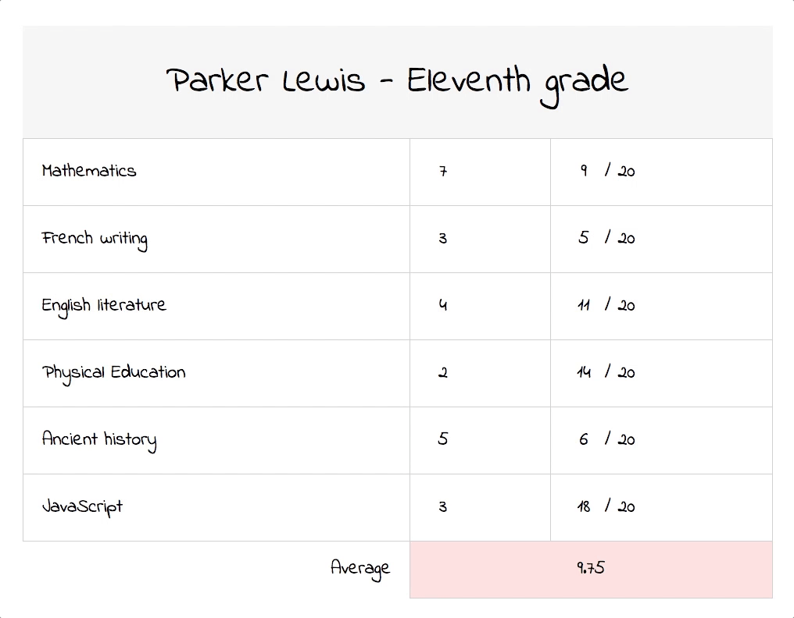

# Challenge Gradebook

Le bulletin de notes en JS :memo:

## Instructions

Parker Lewis ne perd jamais… …jusqu'à aujourd'hui :scream:  
Ses notes ne sont pas suffisantes pour obtenir son diplôme.

Aidez-le à trafiquer son bulletin de notes ! 🙂

Vous êtes responsable de la création le tableau de notes en JS.  
Parker vous demande d'être assez gentil pour le laisser modifier ses notes…

Quand on modifie un coefficient ou une note, la moyenne doit changer.

## Charte

Comme vous voulez :smiley: !
Si le JS fonctionne, c'est le principal.

Bon allez, une p'tite police « effet » main pour faire croire à un vrai bulletin !  
* https://fonts.google.com/specimen/Indie+Flower

## Help

Quand on fait du déclaratif, c'est simple :
* On a des données, et on construit l'application avec.
* Quand on change les données, on reconstruit toute l'appli !

Pour changer les notes, vous pouvez faire des `<input>` et écouter leur _changement_ :wink:
